# BÁO CÁO PHÂN TÍCH VÀ THIẾT KẾ HỆ THỐNG THÔNG TIN
## ĐỀ TÀI: HỆ THỐNG ĐẶT VÉ THAM GIA SỰ KIỆN TRỰC TUYẾN
**Học viện Công nghệ Bưu chính Viễn thông (PTIT)**  
**Lớp học phần:** N12 | **Giảng viên hướng dẫn:** TS. Nguyễn Đức Hiển (Email: `ndhien@hotmail.com`)  
**Tệp nộp bài Word:** `N12 Nhóm 01.docx` (kèm tệp hoàn chỉnh: `N12 Nhóm 01 - HoanChinh.docx`)

---

## 1. MÃ SỐ NHÓM, TÊN ĐỀ TÀI, HỌ TÊN CÁC THÀNH VIÊN – CHỨC NĂNG

* **Tên đề tài:** Xây dựng Hệ thống đặt vé tham gia sự kiện trực tuyến (*Online Event Ticket Booking System*).
* **Mã số nhóm:** Nhóm 01 (Lớp tín chỉ: N12) *(Sinh viên có thể tùy biến sang mã số nhóm thực tế)*.
* **Mục tiêu hệ thống:** Hệ thống cung cấp giải pháp bán vé sự kiện đa quy mô (Liveshow, Concert, Kịch, Thể thao, Hội thảo), giải quyết triệt để bài toán thắt nút cổ chai (Bottleneck) khi mở bán vé giờ cao điểm thông qua cơ chế **Phòng chờ ảo (Virtual Waiting Queue)**, hiển thị **Sơ đồ khán đài theo thời gian thực (Real-time Seat Map)**, cơ chế **Giữ ghế tạm thời (Countdown Timer)**, thanh toán trực tuyến an toàn và phát hành **Vé điện tử kèm mã QR Code động**.

### Bảng phân công thành viên và chức năng phụ trách

| STT | Họ và tên | Mã sinh viên | Vai trò | Phân hệ (Module) & Chức năng phụ trách chính |
|:---:|:---|:---:|:---:|:---|
| **1** | **Nguyễn Văn A** | B21DCCN001 | Nhóm trưởng | **Module 1: Quản lý tài khoản người dùng** • Đăng ký, đăng nhập tài khoản (phân quyền Role-based) • Đổi mật khẩu, lấy lại mật khẩu qua mã xác thực Email OTP • Chỉnh sửa thông tin hồ sơ cá nhân • Cấu hình tùy chọn nhận thông báo và email |
| **2** | **Trần Thị B** | B21DCCN002 | Thành viên | **Module 2: Tìm kiếm & Xem sự kiện** • Xem danh sách sự kiện nổi bật, thịnh hành (Trending/Hot) • Tìm kiếm và lọc đa tiêu chí (ngày diễn, địa điểm, thể loại, khoảng giá) • Xem trang chi tiết sự kiện, dàn nghệ sĩ/khách mời biểu diễn • Lưu danh sách sự kiện yêu thích (Wishlist) & chia sẻ sự kiện |
| **3** | **Lê Văn C** | B21DCCN003 | Thành viên | **Module 3: Xếp hàng và chọn chỗ** • Xếp hàng đợi ảo (Virtual Queue) khi lưu lượng truy cập lớn • Hiển thị sơ đồ khán đài và trạng thái từng ghế thời gian thực • Chọn vị trí ghế ngồi (VIP, Standard, Fan Zone, vé đứng) • Khóa giữ ghế tạm thời (10–15 phút có bộ đếm ngược) |
| **4** | **Phạm Thị D** | B21DCCN004 | Thành viên | **Module 4: Tính tiền và Xuất vé** • Tạo đơn hàng mua vé, áp dụng mã voucher giảm giá • Thanh toán trực tuyến qua cổng VNPAY, Ví MoMo, Thẻ ATM/Visa • Xử lý giao dịch và sinh mã vé điện tử QR Code động chống giả mạo • Gửi vé qua Email và lưu trữ vào danh mục "Vé của tôi" |
| **5** | **Hoàng Văn E** | B21DCCN005 | Thành viên | **Chức năng 5: Xem thống kê doanh thu sự kiện** • Tiếp nhận yêu cầu tra cứu từ Ban tổ chức • Tính toán các chỉ số KPIs (Gross/Net Revenue, Occupancy Rate) • Phân tích tỷ trọng đóng góp theo từng phân khu khán đài • Kết xuất báo cáo thống kê trực quan (dashboard & file) |

---

## 2. BIỂU ĐỒ USE CASE CHO HỆ THỐNG VÀ CHO CÁC CHỨC NĂNG

### 2.1. Biểu đồ Use Case tổng thể toàn hệ thống

Biểu đồ bao quát toàn bộ 5 phân hệ chức năng tương tác với các tác nhân trong và ngoài hệ thống:
* **Tác nhân chính (Actors):**
  * `Khách hàng (Customer)`: Tìm kiếm sự kiện, xếp hàng, chọn ghế, thanh toán và nhận vé điện tử.
  * `Ban tổ chức (Organizer)`: Thiết kế sơ đồ ghế, đăng sự kiện, cấu hình giá vé, quản lý check-in và xem báo cáo doanh thu.
  * `Quản trị viên (Administrator)`: Quản lý người dùng, duyệt sự kiện và giám sát vận hành hệ thống.
* **Tác nhân hệ thống ngoài (External Systems):**
  * `Cổng thanh toán (Payment Gateway)`: VNPAY / MoMo xử lý giao dịch tài chính trực tuyến.
  * `Dịch vụ Email/SMS (Notification Service)`: Gửi OTP xác thực, thông báo mở bán và tệp vé điện tử QR.

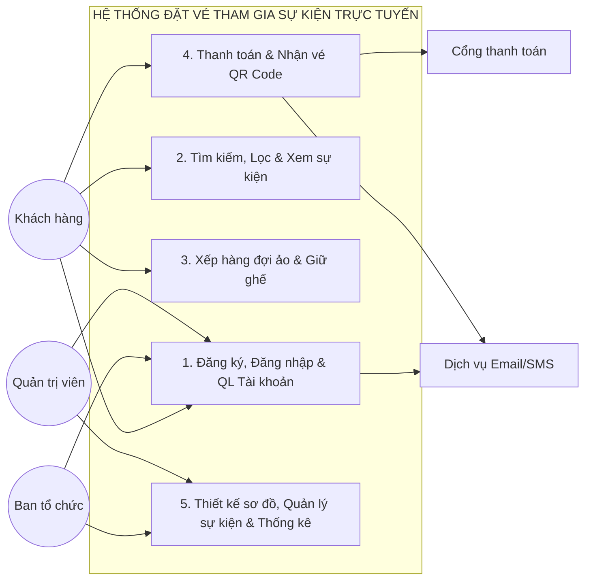

---

### 2.2. Biểu đồ Use Case Phân hệ 1: Quản lý tài khoản người dùng

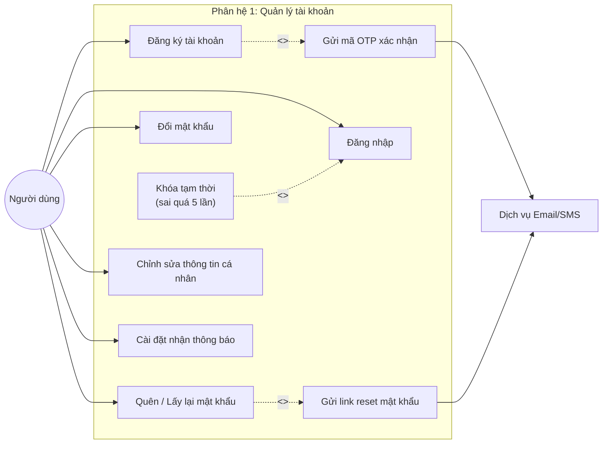

**Đặc tả tóm tắt Use Case Phân hệ 1:**
* **Đăng ký tài khoản:** Khách hàng điền thông tin -> Hệ thống validate dữ liệu -> Gửi mã OTP xác thực email -> Hoàn tất kích hoạt tài khoản.
* **Đăng nhập:** Người dùng nhập username/email và mật khẩu -> Hệ thống băm kiểm tra (BCrypt) -> Cấp JWT Token. Nếu nhập sai 5 lần liên tiếp, kích hoạt Use Case mở rộng khóa tài khoản trong 15 phút.
* **Quên mật khẩu:** Người dùng nhập email -> Nhận mã bảo mật qua email -> Nhập mật khẩu mới.

---

### 2.3. Biểu đồ Use Case Phân hệ 2: Tìm kiếm & Xem sự kiện

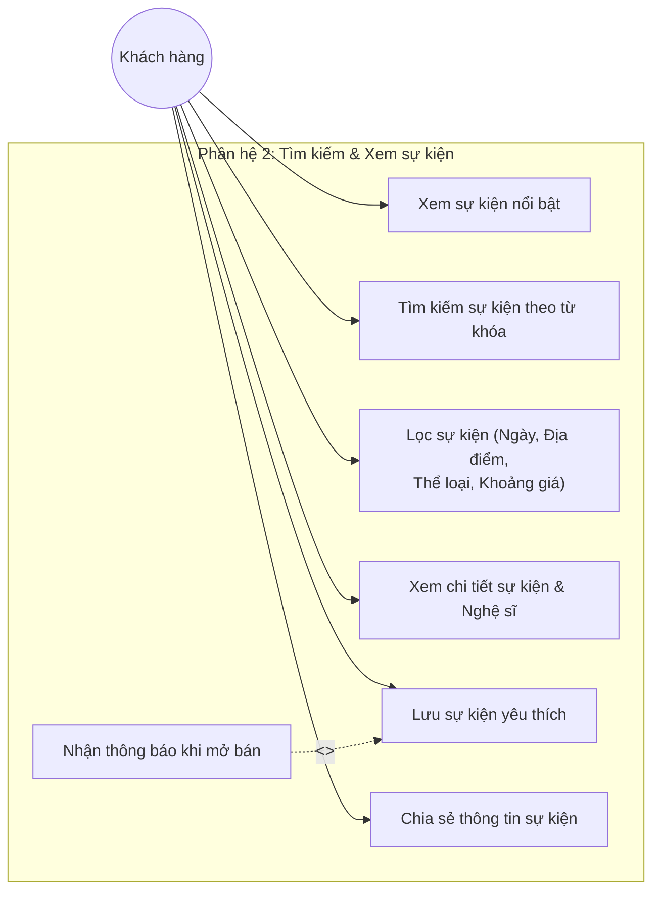

**Đặc tả tóm tắt Use Case Phân hệ 2:**
* **Tìm kiếm & Lọc sự kiện:** Người dùng tìm kiếm toàn văn theo tên nghệ sĩ, sự kiện; áp dụng bộ lọc đa chiều (theo thành phố, thời gian diễn ra cuối tuần này, thể loại nhạc kịch/Concert, giá vé từ thấp đến cao).
* **Xem chi tiết sự kiện:** Hiển thị poster, mô tả kịch bản, lịch diễn các suất (Showtimes), dàn nghệ sĩ khách mời, sơ đồ khán đài và chính sách vé.
* **Lưu sự kiện yêu thích:** Khách hàng đánh dấu lưu sự kiện; hệ thống tự động gửi thông báo đẩy (Push/Email) nhắc nhở trước thời điểm mở bán vé chính thức 30 phút.

---

### 2.4. Biểu đồ Use Case Phân hệ 3: Xếp hàng và chọn chỗ

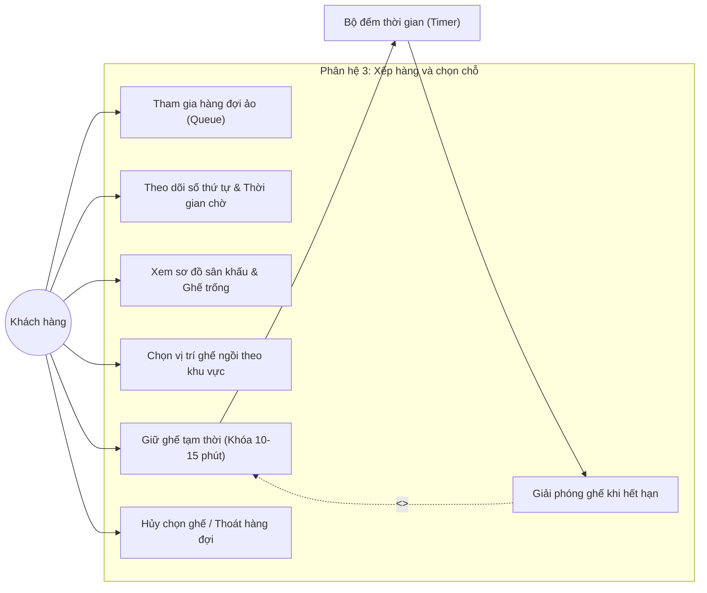

**Đặc tả tóm tắt Use Case Phân hệ 3:**
* **Tham gia hàng đợi ảo (Virtual Waiting Room):** Khi sự kiện có số lượng truy cập đồng thời lớn hơn ngưỡng chịu tải, người dùng được xếp vào hàng đợi FIFO. Màn hình hiển thị số thứ tự và thời gian ước tính. Khi tới lượt, hệ thống cấp `QueueToken` cho phép chuyển vào giao diện chọn ghế.
* **Xem sơ đồ & Giữ ghế tạm thời:** Tải sơ đồ ghế dạng SVG thời gian thực qua WebSocket. Ghế được phân loại theo màu sắc: Trắng (trống), Đỏ (đã bán), Vàng (đang chọn). Khi bấm chọn, ghế chuyển sang trạng thái "Tạm khóa" với đồng hồ đếm ngược 10 phút. Nếu hết 10 phút chưa thanh toán, hệ thống tự động giải phóng ghế trả lại trạng thái trống.

---

### 2.5. Biểu đồ Use Case Phân hệ 4: Tính tiền và Xuất vé

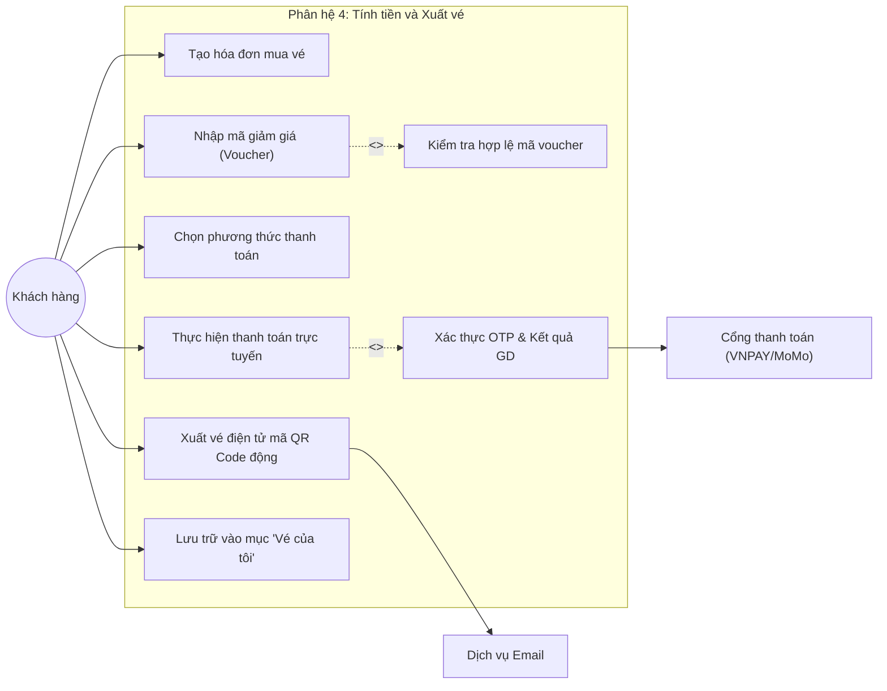

**Đặc tả tóm tắt Use Case Phân hệ 4:**
* **Tạo đơn hàng & Nhập voucher:** Hệ thống tổng hợp các ghế đang giữ, tính tạm tính. Người dùng nhập mã giảm giá -> Hệ thống kiểm tra điều kiện (hạn dùng, đơn tối thiểu, số lượng còn) -> Áp dụng giảm giá và tính tổng tiền thanh toán cuối.
* **Thanh toán trực tuyến:** Người dùng chọn VNPAY-QR, Thẻ ATM/Visa hoặc Ví MoMo -> Chuyển hướng sang cổng thanh toán -> Xác thực OTP ngân hàng -> Webhook trả về kết quả thành công -> Cập nhật trạng thái đơn hàng thành `PAID`.
* **Xuất vé điện tử:** Hệ thống sinh mã vé và chuỗi mã hóa QR Code độc nhất chứa chữ ký điện tử -> Gửi vé định dạng PDF/QR qua Email và lưu trữ vào danh mục "Vé của tôi".

---

### 2.6. Biểu đồ Use Case Chức năng 5: Xem thống kê doanh thu sự kiện

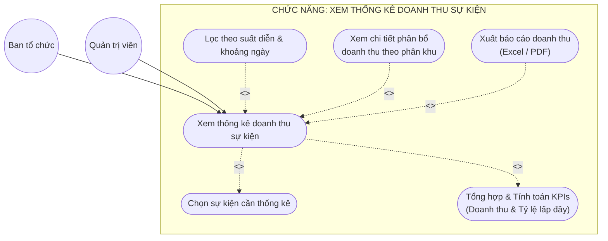

* **Ý nghĩa ca sử dụng:** Chức năng 5 tập trung duy nhất vào nghiệp vụ đơn lẻ: **Xem thống kê doanh thu sự kiện** (View Event Revenue Statistics) dành cho Ban tổ chức và Quản trị viên.
* **Quan hệ `<<include>>` (Bắt buộc):**
  * `Chọn sự kiện cần thống kê`: Xác định đối tượng sự kiện cần kết xuất báo cáo tài chính.
  * `Tổng hợp & Tính toán KPIs`: Bước tính toán tự động các chỉ số doanh thu gộp, doanh thu thuần, tỷ lệ lấp đầy và giá vé bình quân.
* **Quan hệ `<<extend>>` (Tùy chọn mở rộng):**
  * `Lọc theo suất diễn & khoảng ngày`: Mở rộng khi cần thống kê thu hẹp.
  * `Xem chi tiết phân bổ doanh thu theo phân khu`: Mở rộng khi cần phân tích sâu tỷ trọng từng hạng vé.
  * `Xuất báo cáo doanh thu (Excel / PDF)`: Mở rộng khi cần lưu tệp ngoại tuyến về máy.

---

## 3. KỊCH BẢN PHÂN TÍCH CHO CÁC CHỨC NĂNG (SCENARIO)

Dưới đây là kịch bản phân tích chi tiết (Scenario) được xây dựng theo format chuẩn của môn học dành riêng cho **Chức năng 5: Xem thống kê doanh thu sự kiện** (*View Event Revenue Statistics*):

### Scenario cho chức năng: Xem thống kê doanh thu sự kiện

| Mục kịch bản | Nội dung chi tiết |
|:---|:---|
| **Tên use case** | `XemThongKeDoanhThuSuKien` (`ViewEventRevenueStatistics`) |
| **Tác nhân chính** | Ban tổ chức sự kiện (`Organizer`), Quản trị viên (`Admin`) |
| **Tiền điều kiện** | Khi người dùng muốn xem báo cáo thống kê doanh thu phải đăng nhập thành công vào hệ thống với vai trò Ban tổ chức hoặc Quản trị viên. Sự kiện đã được tạo, cấu hình phân khu giá vé và đã mở bán vé (phát sinh dữ liệu đơn hàng). |
| **Đảm bảo tối thiểu** | Hệ thống hiển thị thông báo sự kiện chưa có dữ liệu hoặc lỗi kết nối, giữ nguyên giao diện để người dùng chọn lại sự kiện khác. |
| **Đảm bảo thành công** | Hệ thống tổng hợp, tính toán đầy đủ và hiển thị chính xác các chỉ số tài chính (Tổng doanh thu gộp, Doanh thu thuần sau thuế và phí, Tỷ lệ lấp đầy khán đài, Giá vé bình quân, Đánh giá hiệu suất) cùng bảng biểu chi tiết và biểu đồ phân bổ doanh thu theo từng phân khu. |
| **Kích hoạt** | Người dùng chọn chức năng 'Xem thống kê doanh thu sự kiện' trên thanh menu/bảng điều khiển hệ thống. |
| **Chuỗi sự kiện chính:** | 1. Người dùng chọn chức năng 'Xem thống kê doanh thu sự kiện' từ menu điều hướng của hệ thống. 2. Hệ thống hiển thị Form thống kê: yêu cầu người dùng chọn sự kiện từ danh sách sự kiện đang quản lý (`eventSelector`) và tùy chọn khoảng thời gian lọc (`datePicker`). 3. Người dùng chọn sự kiện cần xem từ danh sách, chọn khoảng thời gian tra cứu và nhấn nút 'Tra cứu'. 4. Hệ thống kiểm tra dữ liệu sự kiện, nạp danh sách các phân khu vé (`ZonePricing`), các suất diễn (`Showtime`) và các hóa đơn vé đã thanh toán thành công. 5. Hệ thống thực hiện chuỗi phương thức tính toán tài chính nội tại: &nbsp;&nbsp;&nbsp;• Tính tổng sức chứa phát hành: `calculateTotalCapacity()` &nbsp;&nbsp;&nbsp;• Tính tổng số vé đã bán thành công: `calculateTotalTicketsSold()` &nbsp;&nbsp;&nbsp;• Tính tổng doanh thu bán vé gộp: `calculateGrossRevenue()` &nbsp;&nbsp;&nbsp;• Khấu trừ 10% VAT và 5% phí sàn để tính doanh thu thuần: `calculateNetRevenue()` &nbsp;&nbsp;&nbsp;• Tính tỷ lệ lấp đầy khán đài: `calculateOccupancyRate()` &nbsp;&nbsp;&nbsp;• Tính giá vé bình quân mỗi vé bán ra: `calculateAverageTicketPrice()` &nbsp;&nbsp;&nbsp;• Tính tỷ trọng đóng góp doanh thu của từng phân khu: `calculateZoneContribution(zoneId)` &nbsp;&nbsp;&nbsp;• Đánh giá xếp hạng hiệu quả mở bán: `evaluatePerformance()` 6. Hệ thống hiển thị toàn bộ các thẻ KPI chỉ số tài chính, bảng chi tiết từng phân khu vé và vẽ biểu đồ tỷ trọng phân bổ doanh thu trực quan. |
| **Ngoại lệ:** | **4.a. Sự kiện được chọn chưa có giao dịch bán vé nào phát sinh trong khoảng thời gian tra cứu** &nbsp;&nbsp;&nbsp;&nbsp;&nbsp;&nbsp;4.a.1. Hệ thống hiển thị thông báo: 'Sự kiện chưa phát sinh giao dịch bán vé' &nbsp;&nbsp;&nbsp;&nbsp;&nbsp;&nbsp;4.a.2. Hiển thị các chỉ số ở mức mặc định (0 VNĐ, 0%) và cho phép người dùng chọn lại sự kiện khác. **4.b. Người dùng nhập khoảng thời gian lọc không hợp lệ (Ngày bắt đầu > Ngày kết thúc)** &nbsp;&nbsp;&nbsp;&nbsp;&nbsp;&nbsp;4.b.1. Hệ thống hiển thị thông báo lỗi: 'Khoảng thời gian tra cứu không hợp lệ' &nbsp;&nbsp;&nbsp;&nbsp;&nbsp;&nbsp;4.b.2. Đặt lại khoảng thời gian mặc định là toàn bộ thời gian mở bán của sự kiện. **4.c. Lỗi kết nối máy chủ cơ sở dữ liệu hoặc hệ thống tính toán** &nbsp;&nbsp;&nbsp;&nbsp;&nbsp;&nbsp;4.c.1. Hệ thống hiển thị thông báo: 'Lỗi kết xuất dữ liệu thống kê, vui lòng thử lại sau' &nbsp;&nbsp;&nbsp;&nbsp;&nbsp;&nbsp;4.c.2. Giữ nguyên giao diện ban đầu. |

---

## 4. KỊCH BẢN VÀ THIẾT KẾ GIAO DIỆN CHO CÁC CHỨC NĂNG

Thiết kế giao diện cho **Chức năng 5: Xem thống kê doanh thu sự kiện** (`RevenueReportView`) được tối ưu hóa nhằm cung cấp trải nghiệm phân tích tài chính trực quan, rõ ràng và tức thì cho Ban tổ chức.

### 4.1. Bảng đặc tả các thành phần điều khiển trên giao diện (UI Controls Specification)

| Mã điều khiển | Tên thành phần | Kiểu điều khiển (Type) | Ý nghĩa nghiệp vụ & Ràng buộc dữ liệu |
|:---|:---|:---|:---|
| `cb_event` | Chọn sự kiện | ComboBox (Dropdown) | Danh sách các sự kiện do ban tổ chức quản lý. Ràng buộc: bắt buộc chọn 1 sự kiện. |
| `dp_from_date`| Từ ngày | DatePicker / TextInput | Ngày bắt đầu lọc số liệu (DD/MM/YYYY). Mặc định: ngày mở bán vé đầu tiên. |
| `dp_to_date` | Đến ngày | DatePicker / TextInput | Ngày kết thúc lọc số liệu (DD/MM/YYYY). Ràng buộc: phải $\ge$ `dp_from_date`. |
| `btn_search` | Tra cứu | Button (Primary Blue) | Kích hoạt gửi yêu cầu tra cứu và tính toán số liệu thống kê. |
| `btn_excel` | Xuất Excel | Button (Success Green) | Kết xuất toàn bộ bảng số liệu phân tích ra tệp bảng tính `.xlsx`. |
| `btn_pdf` | In PDF | Button (Danger Red) | Tạo tài liệu báo cáo định dạng `.pdf` chuẩn hóa để in ấn hoặc ký duyệt. |
| `card_gross` | Tổng doanh thu gộp | KPI Card (Blue) | Hiển thị tổng số tiền bán vé thu được trước thuế phí (`Gross Revenue`). |
| `card_net` | Doanh thu thuần | KPI Card (Green) | Hiển thị số tiền thực nhận sau khi khấu trừ 10% VAT và 5% phí nền tảng (`Net Revenue`). |
| `card_occupancy`| Tỷ lệ lấp đầy | KPI Card (Amber) | Hiển thị phần trăm số ghế đã bán trên tổng sức chứa và xếp hạng (`EXCELLENT`). |
| `card_avg_price`| Giá vé bình quân | KPI Card (Purple) | Hiển thị giá bán trung bình trên mỗi vé thành công (`Average Ticket Price`). |
| `chart_zone` | Biểu đồ phân bổ phân khu | Donut Chart | Biểu đồ tròn trực quan tỷ trọng đóng góp doanh thu của từng phân khu vé. |
| `tbl_breakdown`| Bảng chi tiết phân khu | Data Table | Liệt kê chi tiết từng phân khu: Đơn giá, Chỉ tiêu, Đã bán, Tỷ lệ lấp đầy, Doanh thu gộp, Tỷ trọng. |

### 4.2. Kịch bản tương tác người dùng - hệ thống (UI Interaction Scenario)

| Bước | Hành động của người dùng (User Action) | Phản hồi của hệ thống (System Response) |
|:---:|:---|:---|
| **1** | Người dùng truy cập vào mục 'Thống kê doanh thu' từ menu hệ thống. | Hệ thống tải giao diện `RevenueReportView`, nạp danh sách các sự kiện vào `cb_event`, đặt khoảng ngày mặc định là 30 ngày gần nhất. |
| **2** | Người dùng nhấp vào `cb_event` và chọn sự kiện "Born Pink World Tour Hanoi 2026". | Hệ thống ghi nhận mã sự kiện `eventId`, tự động cập nhật ngày mở bán và ngày kết thúc sự kiện vào 2 ô DatePicker. |
| **3** | Người dùng nhấp nút 'Tra cứu' (`btn_search`). | Giao diện hiển thị biểu tượng tải dữ liệu (loading spinner). Controller nạp Entity `RevenueReport`, kích hoạt chuỗi tính toán và trả về `RevenueSummaryDto`. |
| **4** | Hệ thống nhận kết quả tính toán thành công. | Giao diện cập nhật tức thì 4 thẻ KPI, kết xuất biểu đồ Donut tỷ trọng doanh thu bên trái và điền đầy đủ dữ liệu vào bảng chi tiết phân khu bên phải. |
| **5** | Người dùng rê chuột vào các phần của biểu đồ Donut. | Hệ thống hiển thị tooltip chi tiết: Tên phân khu, doanh thu thu được và tỷ lệ phần trăm đóng góp. |
| **6** | Người dùng nhấp nút 'Xuất Excel' hoặc 'In PDF'. | Hệ thống gọi phương thức `exportExcel()` / `exportPdf()`, hiển thị hộp thoại tải tệp xuống máy tính của người dùng. |

### 4.3. Bản vẽ thiết kế giao diện trực quan (UI Mockup Wireframe)

Toàn bộ bố cục màn hình được phân chia khoa học thành 4 vùng chức năng (Thanh điều hướng bộ lọc $\rightarrow$ Khung thẻ KPI $\rightarrow$ Khung biểu đồ Donut $\rightarrow$ Bảng phân tích chi tiết):

*(Tham khảo tệp ảnh thiết kế độ phân giải cao đính kèm: `PTTK/diagrams/ui_m5_view_revenue.png`)*

---

## 5. BIỂU ĐỒ LỚP THỰC THỂ PHÂN TÍCH CHO HỆ THỐNG VÀ CHO CÁC CHỨC NĂNG

### Nguyên lý lớp phân tích (Analysis Entity Classes)
1. Thể hiện các **khái niệm nghiệp vụ cốt lõi** trong miền bài toán (Domain Model).
2. Mỗi lớp gồm 2 ngăn: **Tên thực thể** và **Danh sách thuộc tính nghiệp vụ thuần túy**.
3. Không phụ thuộc vào kiểu dữ liệu lập trình cụ thể (`int`, `varchar2`, `boolean`...), không có các hàm kỹ thuật `getter/setter`.
4. Thể hiện rõ các mối quan hệ ngữ nghĩa: Kế thừa (Generalization), Kết hợp (Association), Kết tập mạnh (Composition), Kết tập yếu (Aggregation) cùng bản số (Multiplicity).

### 3.1. Biểu đồ lớp thực thể phân tích tổng thể hệ thống

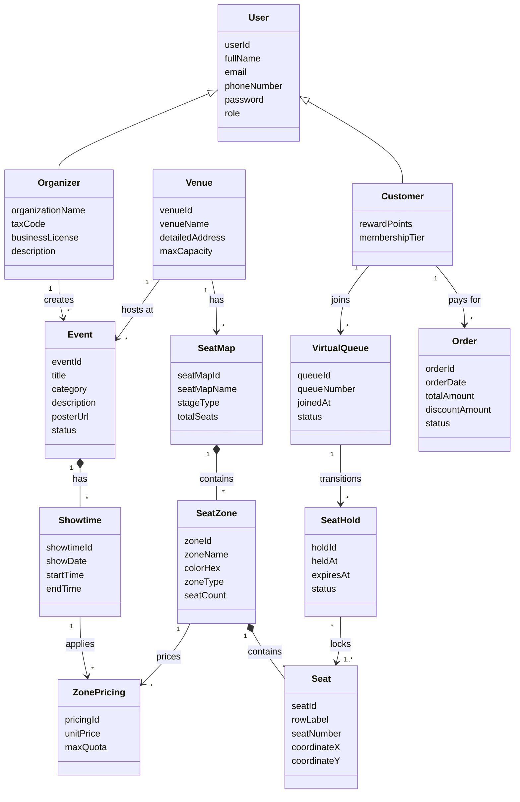

---

### 3.2. Biểu đồ lớp phân tích theo từng phân hệ

#### Phân hệ 1: Quản lý tài khoản người dùng
* Các thực thể: `User`, `Customer`, `Organizer`, `UserSession`, `Notification`.
* Quan hệ: Kế thừa từ `User`; Khách hàng sở hữu nhiều `UserSession`; Người dùng nhận nhiều `Notification`.

#### Phân hệ 2: Tìm kiếm & Xem sự kiện
* Các thực thể: `Event`, `Category`, `Venue`, `Showtime`, `Artist`, `FavoriteEvent`.
* Quan hệ: Sự kiện thuộc một Thể loại (`Category`), tổ chức tại một Địa điểm (`Venue`), bao hàm nhiều Suất diễn (`Showtime`); Nghệ sĩ (`Artist`) biểu diễn tại nhiều Suất diễn; Khách hàng lưu sự kiện vào danh sách Yêu thích (`FavoriteEvent`).

#### Phân hệ 3: Xếp hàng và chọn chỗ
* Các thực thể: `SeatMap`, `SeatZone`, `Seat`, `Customer`, `VirtualQueue`, `SeatHold`.
* Quan hệ: Cấu trúc phân cấp chứa `SeatMap` -> `SeatZone` -> `Seat`; Khách hàng vào `VirtualQueue`; Khi đến lượt tạo bản ghi `SeatHold` liên kết với danh sách các `Seat` đã chọn.

#### Phân hệ 4: Tính tiền và Xuất vé
* Các thực thể: `Order`, `Ticket`, `Voucher`, `PaymentTransaction`, `Customer`, `Seat`.
* Quan hệ: `Order` do `Customer` lập, áp dụng 0..1 `Voucher`, thanh toán qua 1 `PaymentTransaction`, và bao hàm 1..* `Ticket`. Mỗi `Ticket` được gán cố định cho 1 `Seat`.

#### Chức năng 5: Xem thống kê doanh thu sự kiện
* Các thực thể: `Organizer`, `Event`, `Showtime`, `ZonePricing`, `RevenueReport`, `SeatZone`.
* Quan hệ: Ban tổ chức (`Organizer`) yêu cầu báo cáo doanh thu cho Sự kiện (`Event`); Thực thể `RevenueReport` tổng hợp các phân khu vé (`ZonePricing`) và suất diễn (`Showtime`), trực tiếp đóng gói toàn bộ phương thức tính toán tài chính.

---

### 3.3. Biểu đồ lớp phân tích Chức năng 5: Xem thống kê doanh thu sự kiện

Để giải quyết triệt để yêu cầu: *"Nếu là class thì cần có các phương thức thực hiện tính toán, nếu không chỉ là nhóm dữ liệu không được coi là class"*, biểu đồ lớp phân tích dưới đây thể hiện toàn diện các phương thức tính toán tài chính của các thực thể tham gia ca sử dụng này:

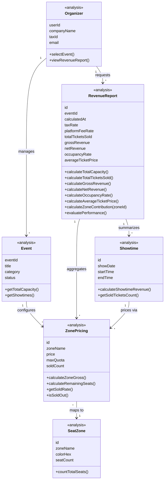

---

## 6. BIỂU ĐỒ LỚP THỰC THỂ THIẾT KẾ CHO HỆ THỐNG VÀ CHO CÁC CHỨC NĂNG

### Nguyên lý lớp thiết kế (Design Entity Classes)
1. Thể hiện **mô hình hướng đối tượng chi tiết** sẵn sàng ánh xạ ORM (JPA/Hibernate) và sinh mã nguồn.
2. Stereotype `<<entity>>` cho các thực thể dữ liệu.
3. Cấu trúc chuẩn 3 ngăn: **Tên lớp**, **Thuộc tính với phạm vi (`-` private), tên biến và kiểu dữ liệu cụ thể, khóa chính [PK]**, **Phương thức với phạm vi (`+` public), tham số và kiểu trả về**.
4. Các phương thức nghiệp vụ nội tại được mô hình hóa rõ ràng.

### 4.1. Biểu đồ lớp thực thể thiết kế tổng thể hệ thống

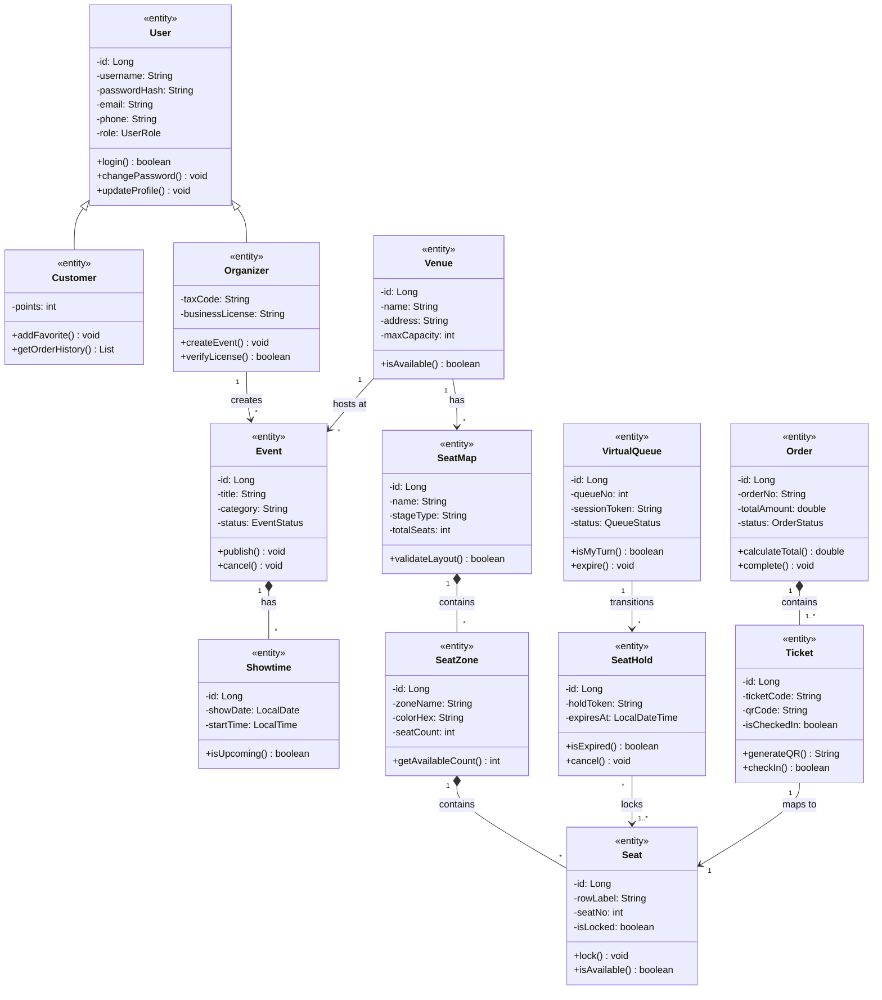

---

### 4.2. Từ điển dữ liệu và Lớp thiết kế chi tiết theo 5 phân hệ

#### Phân hệ 1: Quản lý tài khoản (Classes: User, Customer, Organizer, UserSession, Notification)
| Lớp thiết kế | Thuộc tính chi tiết (Kiểu dữ liệu & Ràng buộc) | Phương thức nghiệp vụ (Operations) |
|:---|:---|:---|
| **User** | `- id: Long [PK, Auto]` `- username: String [Unique]` `- passwordHash: String [BCrypt]` `- email: String [Unique]` `- phone: String` `- role: UserRole [Enum]` | `+ authenticate(pwd: String): boolean` `+ changePassword(newPwd: String): void` `+ updateInfo(dto: UserDto): void` `+ isAccountNonLocked(): boolean` |
| **Customer** | `- rewardPoints: int [Default 0]` `- memberTier: MemberTier [Enum]` | `+ addRewardPoints(pts: int): void` `+ getOrderHistory(): List<Order>` `+ canRedeemPoints(pts: int): boolean` |
| **Organizer** | `- orgName: String [Not Null]` `- taxId: String [Unique]` `- businessLicense: String` | `+ verifyLicense(): boolean` `+ getManagedEvents(): List<Event>` `+ updateOrgProfile(info: OrgDto): void` |
| **UserSession** | `- id: Long [PK]` `- jwtToken: String [Not Null]` `- createdAt: LocalDateTime` `- expiresAt: LocalDateTime` | `+ isExpired(): boolean` `+ refreshToken(): String` `+ revoke(): void` |
| **Notification**| `- id: Long [PK]` `- title: String` `- message: String` `- isRead: boolean [Default false]` | `+ markAsRead(): void` `+ sendEmailNotification(): boolean` |

---

#### Phân hệ 2: Tìm kiếm & Xem sự kiện (Classes: Event, Showtime, Category, Venue, Artist, FavoriteEvent)
| Lớp thiết kế | Thuộc tính chi tiết (Kiểu dữ liệu & Ràng buộc) | Phương thức nghiệp vụ (Operations) |
|:---|:---|:---|
| **Event** | `- id: Long [PK]` `- title: String [Not Null]` `- description: String` `- bannerUrl: String` `- status: EventStatus [Enum]` | `+ publish(): void` `+ cancel(): void` `+ isUpcoming(): boolean` `+ getActiveShowtimes(): List<Showtime>` |
| **Showtime** | `- id: Long [PK]` `- showDate: LocalDate [Not Null]` `- startTime: LocalTime [Not Null]` `- endTime: LocalTime` | `+ isAvailableForBooking(): boolean` `+ getAvailableSeats(): int` `+ isOngoing(): boolean` |
| **Category** | `- id: Long [PK]` `- name: String [Unique]` `- code: String [Unique]` | `+ getEvents(): List<Event>` `+ countEvents(): int` |
| **Venue** | `- id: Long [PK]` `- name: String [Not Null]` `- address: String` `- capacity: int [> 0]` | `+ checkCapacity(): boolean` `+ getAssignedSeatMap(): SeatMap` |
| **Artist** | `- id: Long [PK]` `- stageName: String [Not Null]` `- bio: String` `- avatarUrl: String` | `+ getParticipatingEvents(): List<Event>` |
| **FavoriteEvent** | `- id: Long [PK]` `- customerId: Long [FK]` `- savedDate: LocalDateTime` | `+ notifySaleOpening(): void` `+ remove(): void` |

---

#### Phân hệ 3: Xếp hàng và chọn chỗ (Classes: SeatMap, SeatZone, Seat, VirtualQueue, SeatHold)
| Lớp thiết kế | Thuộc tính chi tiết (Kiểu dữ liệu & Ràng buộc) | Phương thức nghiệp vụ (Operations) |
|:---|:---|:---|
| **SeatMap** | `- id: Long [PK]` `- mapName: String [Not Null]` `- totalSeats: int [> 0]` `- layoutSvg: String [SVG Data]` | `+ validateLayout(): boolean` `+ getZones(): List<SeatZone>` `+ getTotalCapacity(): int` |
| **SeatZone** | `- id: Long [PK]` `- zoneName: String [VIP, CAT 1...]` `- colorHex: String [#HEX]` `- zoneType: ZoneType [SEATED, STANDING]` | `+ getSeats(): List<Seat>` `+ countVacantSeats(): int` `+ isStandingZone(): boolean` |
| **Seat** | `- id: Long [PK]` `- rowLabel: String [A, B, C...]` `- seatNumber: int [1, 2, 3...]` `- isLocked: boolean [Default false]` | `+ lockSeat(token: String): boolean` `+ unlockSeat(): void` `+ isAvailable(): boolean` `+ getSeatCode(): String` |
| **VirtualQueue**| `- id: Long [PK]` `- queueNumber: int [Auto]` `- accessToken: String [UUID]` `- status: QueueStatus [WAITING, SERVING, EXPIRED]` | `+ isTurn(): boolean` `+ generateToken(): String` `+ expireToken(): void` |
| **SeatHold** | `- id: Long [PK]` `- holdToken: String [UUID, Unique]` `- startTime: LocalDateTime` `- expiresAt: LocalDateTime` | `+ isExpired(): boolean` `+ getRemainingSeconds(): long` `+ confirmHold(): void` `+ releaseHold(): void` |

---

#### Phân hệ 4: Tính tiền và Xuất vé (Classes: Order, Voucher, PaymentTransaction, Ticket)
| Lớp thiết kế | Thuộc tính chi tiết (Kiểu dữ liệu & Ràng buộc) | Phương thức nghiệp vụ (Operations) |
|:---|:---|:---|
| **Order** | `- id: Long [PK]` `- orderCode: String [ORD-XXXXX]` `- subTotal: double [>= 0]` `- discount: double [>= 0]` `- finalTotal: double [>= 0]` `- status: OrderStatus [PENDING, PAID, CANCELLED]` | `+ calculateFinalTotal(): double` `+ applyVoucher(v: Voucher): boolean` `+ markAsPaid(): void` `+ cancelOrder(): void` |
| **Voucher** | `- id: Long [PK]` `- code: String [Unique]` `- percentOff: double [0.0 - 100.0]` `- maxDiscount: double` `- validUntil: LocalDate` | `+ isValid(amount: double): boolean` `+ calculateDiscount(amount: double): double` `+ decrementQuota(): void` |
| **PaymentTransaction** | `- id: Long [PK]` `- transRef: String [Bank Ref]` `- method: PaymentMethod [VNPAY, MOMO, VISA]` `- transAmount: double` `- status: TransStatus [SUCCESS, FAILED]` | `+ processPayment(): boolean` `+ verifyWebhook(payload: String): boolean` `+ getGatewayUrl(): String` |
| **Ticket** | `- id: Long [PK]` `- ticketCode: String [TCK-XXXXX]` `- qrCodeHash: String [HMAC-SHA256]` `- price: double` `- isUsed: boolean [Default false]` `- checkinTime: LocalDateTime` | `+ generateEncryptedQR(): String` `+ checkIn(): boolean` `+ isCheckedIn(): boolean` `+ cancelTicket(): void` |

---

---

### 4.3. Thiết kế chi tiết Chức năng 5: Xem thống kê doanh thu sự kiện (View Event Revenue Statistics)

* **Lý do lựa chọn:** Đây là chức năng đơn lẻ (Single Atomic Function - Read/Calculate Analytics) cốt lõi của Module 5. Chức năng yêu cầu các lớp thực thể phải đóng gói đầy đủ **các phương thức thực hiện tính toán tài chính nghiệp vụ**, đảm bảo không biến lớp thành cấu trúc dữ liệu thụ động (*Anemic Domain Model*).

#### a. Đặc tả ca sử dụng chi tiết (Use Case Specification)
| Thuộc tính | Nội dung chi tiết |
|:---|:---|
| **Tên chức năng** | **Xem thống kê doanh thu sự kiện (View Event Revenue Statistics)** |
| **Tác nhân** | Ban tổ chức sự kiện (`Organizer`), Quản trị viên (`Admin`) |
| **Tiền điều kiện** | 1. Ban tổ chức đã đăng nhập vào hệ thống. 2. Sự kiện đã mở bán và phát sinh giao dịch đặt vé. |
| **Hậu điều kiện** | Hiển thị bảng tổng kết các chỉ số tài chính (KPIs) và biểu đồ phân bổ doanh thu theo phân khu. |
| **Luồng sự kiện chính** | 1. Ban tổ chức chọn sự kiện cần xem báo cáo. 2. Giao diện `RevenueReportView` gửi yêu cầu đến `RevenueReportController`. 3. Controller khởi tạo đối tượng `RevenueReport` nạp các phân khu `ZonePricing`. 4. `RevenueReport` gọi chuỗi phương thức tính toán: `calculateGrossRevenue()`, `calculateNetRevenue()`, `calculateOccupancyRate()`, `evaluatePerformance()`. 5. Controller chuyển đổi dữ liệu kết quả thành `RevenueSummaryDto` trả về View. 6. View hiển thị các thẻ KPI và biểu đồ doanh thu trực quan. |

#### b. Biểu đồ tuần tự (Sequence Diagram)
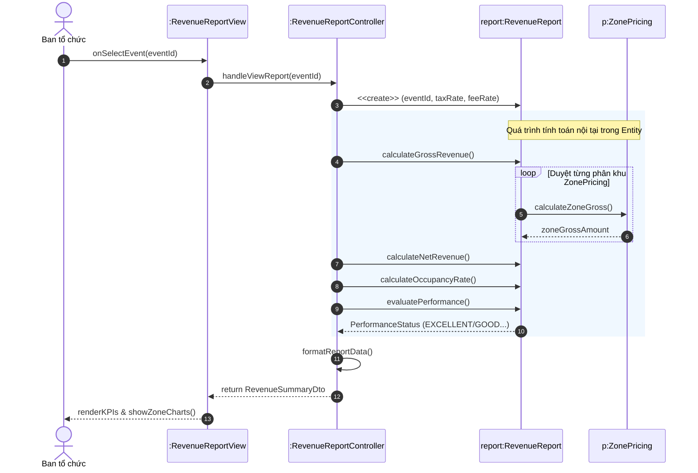

#### c. Biểu đồ lớp thiết kế chi tiết (Mô hình BCE)
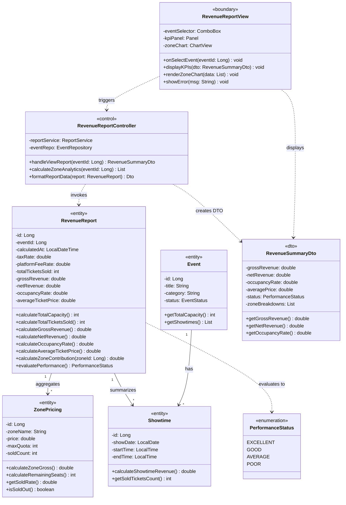

#### d. Bảng chi tiết các phương thức thực hiện tính toán (Computational Methods)
| Tên phương thức | Lớp sở hữu | Kiểu trả về | Công thức & Thuật toán tính toán |
|:---|:---|:---:|:---|
| `calculateTotalCapacity()` | `RevenueReport` | `int` | $\text{TotalCapacity} = \sum \text{zone.seatCount}$ (Tổng số ghế phát hành của tất cả các khu vực). |
| `calculateTotalTicketsSold()` | `RevenueReport` | `int` | $\text{TotalSold} = \sum \text{zone.soldCount}$ (Tổng số vé đã bán thành công). |
| `calculateGrossRevenue()` | `RevenueReport` | `double` | $\text{GrossRevenue} = \sum (\text{zone.soldCount} \times \text{zone.price})$ (Doanh thu bán vé gộp). |
| `calculateNetRevenue()` | `RevenueReport` | `double` | $\text{NetRevenue} = \text{GrossRevenue} \times (1 - \text{taxRate} - \text{platformFeeRate})$ (Doanh thu thuần sau thuế và phí sàn). |
| `calculateOccupancyRate()` | `RevenueReport` | `double` | $\text{OccupancyRate} = \frac{\text{TotalSold}}{\text{TotalCapacity}} \times 100\%$ (Tỷ lệ lấp đầy sân khấu). |
| `calculateAverageTicketPrice()` | `RevenueReport` | `double` | $\text{AvgPrice} = \frac{\text{GrossRevenue}}{\text{TotalSold}}$ (Giá vé bình quân thực tế). |
| `calculateZoneContribution(zoneId)` | `RevenueReport` | `double` | $\text{Contribution} = \frac{\text{ZoneGross}}{\text{GrossRevenue}} \times 100\%$ (Tỷ trọng doanh thu theo từng phân khu). |
| `evaluatePerformance()` | `RevenueReport` | `Enum` | Phân loại hiệu quả tài chính: • $\ge 85\%$: `EXCELLENT` (Cháy vé) • $70\% - 84\%$: `GOOD` (Đạt chỉ tiêu) • $50\% - 69\%$: `AVERAGE` (Hòa vốn) • $< 50\%$: `POOR` (Cần giải cứu) |
| `calculateZoneGross()` | `ZonePricing` | `double` | $\text{ZoneGross} = \text{price} \times \text{soldCount}$ (Doanh thu riêng của phân khu). |
| `getSoldRate()` | `ZonePricing` | `double` | $\text{SoldRate} = \frac{\text{soldCount}}{\text{maxQuota}} \times 100\%$ (Tỷ lệ bán của phân khu). |

#### e. Các ghi chú kiến trúc và thiết kế giải thích chi tiết sơ đồ (Architectural & Design Notes)

1. **Khái niệm DTO (Data Transfer Object) và lý do áp dụng trong kiến trúc:**
   * **Bản chất DTO:** `RevenueSummaryDto` và `ZoneRevenueDto` là các đối tượng truyền tải dữ liệu thuần túy (POJO) giữa tầng Điều khiển (`RevenueReportController`) và tầng Giao diện (`RevenueReportView`).
   * **Lý do thiết kế:**
     * *Tính đóng gói & Bảo mật (Security & Encapsulation):* DTO giúp che giấu cấu trúc bảng cơ sở dữ liệu và các trường nhạy cảm của Entity, không để lộ xuống tầng Presentation.
     * *Làm phẳng dữ liệu & Tối ưu hiệu năng (Performance & Flattening):* Thay vì truyền các đối tượng Entity phức tạp có quan hệ liên kết vòng, Controller gọi các hàm tính toán của Entity, đóng gói toàn bộ kết quả (`grossRevenue`, `netRevenue`, `occupancyRate`, `performanceStatus`) vào một đối tượng DTO phẳng, nhẹ. Giao diện người dùng (UI) chỉ việc đọc các giá trị này để hiển thị lên thẻ KPI và vẽ biểu đồ mà không cần tính toán lại.
     * *Khắc phục lỗi Lazy Loading trong ORM:* Trong JPA/Hibernate, việc truy cập các thuộc tính liên kết lười (Lazy) ngoài phạm vi Session/Transaction dễ dẫn đến ngoại lệ `LazyInitializationException`. DTO được khởi tạo bên trong ranh giới Service/Controller giải quyết triệt để lỗi này.

2. **Phân tách vai trò theo mẫu thiết kế BCE (Boundary - Control - Entity):**
   * `<<boundary>>` (`RevenueReportView`): Lớp giao diện người dùng, chịu trách nhiệm nhận sự kiện tương tác (chọn sự kiện từ ComboBox) và kết xuất dữ liệu DTO lên màn hình (KPI cards, biểu đồ tròn phân khu).
   * `<<control>>` (`RevenueReportController`): Đóng vai trò điều phối luồng xử lý (Orchestrator). Controller **không trực tiếp chứa các công thức toán học tính tiền**, mà điều hướng: nhận yêu cầu từ View $\rightarrow$ nạp Entity $\rightarrow$ kích hoạt các hàm tính toán của Entity $\rightarrow$ đóng gói kết quả vào DTO $\rightarrow$ gửi trả View.
   * `<<entity>>` (`RevenueReport`, `ZonePricing`, `Showtime`, `Event`): Lớp thực thể nghiệp vụ chứa dữ liệu và trực tiếp đóng gói các thuật toán tính toán (*Rich Domain Model*).
   * `<<enumeration>>` (`PerformanceStatus`): Kiểu liệt kê định nghĩa tập hợp các giá trị đánh giá chuẩn mực (`EXCELLENT`, `GOOD`, `AVERAGE`, `POOR`).
   * `<<dto>>` (`RevenueSummaryDto`): Đối tượng mang dữ liệu kết quả giữa Control và Boundary.

3. **Giải quyết quan hệ N-N giữa Showtime và SeatZone thông qua lớp liên kết ZonePricing:**
   * Mối quan hệ giữa Suất diễn (`Showtime`) và Phân khu ghế (`SeatZone`) về bản chất là quan hệ nhiều - nhiều ($*..*$). Tuy nhiên, tại mỗi suất diễn cụ thể, một phân khu sẽ có đơn giá vé riêng (`price`), chỉ tiêu phát hành riêng (`maxQuota`) và số vé đã bán thực tế riêng (`soldCount`).
   * Do đó, lớp `ZonePricing` đóng vai trò là **Lớp liên kết nghiệp vụ (Association Class)**, phân rã quan hệ $*..*$ thành 2 quan hệ $1..*$:
     $$\text{Showtime } (1) \longrightarrow (*) \text{ ZonePricing } (*) \longleftarrow (1) \text{ SeatZone}$$
   * Thiết kế này loại bỏ hoàn toàn sự dư thừa liên kết (*Redundant Association*) và phản ánh chính xác nghiệp vụ bán vé theo từng đêm diễn.

4. **Nguyên lý đóng gói hành vi tính toán (Information Expert - GRASP):**
   * Theo nguyên lý *Information Expert*, trách nhiệm tính toán phải được gán cho lớp sở hữu đầy đủ thông tin nhất để thực hiện tính toán đó. Do `RevenueReport` chứa tập hợp các phân khu `ZonePricing` và thuế phí, việc đặt các phương thức `calculateGrossRevenue()`, `calculateNetRevenue()`, `calculateOccupancyRate()` trực tiếp trong `RevenueReport` đảm bảo lớp có cả **Trạng thái (State)** và **Hành vi (Behavior)**, đáp ứng tiêu chuẩn khắt khe của môn học, tránh mô hình *Anemic Domain Model*.

---

## 7. HƯỚNG DẪN NỘP BÀI VÀ THAY ĐỔI THÔNG TIN NHÓM

1. **Tệp tài liệu nộp Thầy Hiển:**
   * Tệp Word chính thức đã nhúng đầy đủ 22 sơ đồ & mockup: **`PTTK/N13 Nhóm 01.docx`** (hoặc `PTTK/N12 Nhóm 01 - HoanChinh.docx`).
   * Thư mục chứa toàn bộ ảnh sơ đồ chất lượng cao (300 DPI): `PTTK/diagrams/`.
2. **Email nhận bài:** `ndhien@hotmail.com`
3. **Tiêu đề email & tên tệp:** `N13<Nhóm Mã số>.docx` hoặc `N12<Nhóm Mã số>.docx` (Ví dụ: `N13 Nhóm 01.docx`).
4. **Cách thay đổi mã nhóm hoặc họ tên thành viên trong 1 câu lệnh:**
   * Mở tệp `generate_word_report.py`, chỉnh sửa thông tin trong mảng `members_data` và `meta_data`.
   * Chạy lệnh `python generate_word_report.py` để sinh lại tệp Word ngay lập tức.
