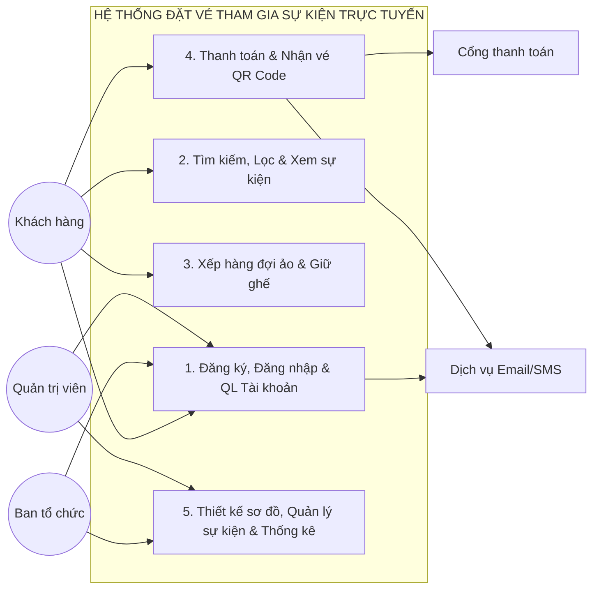
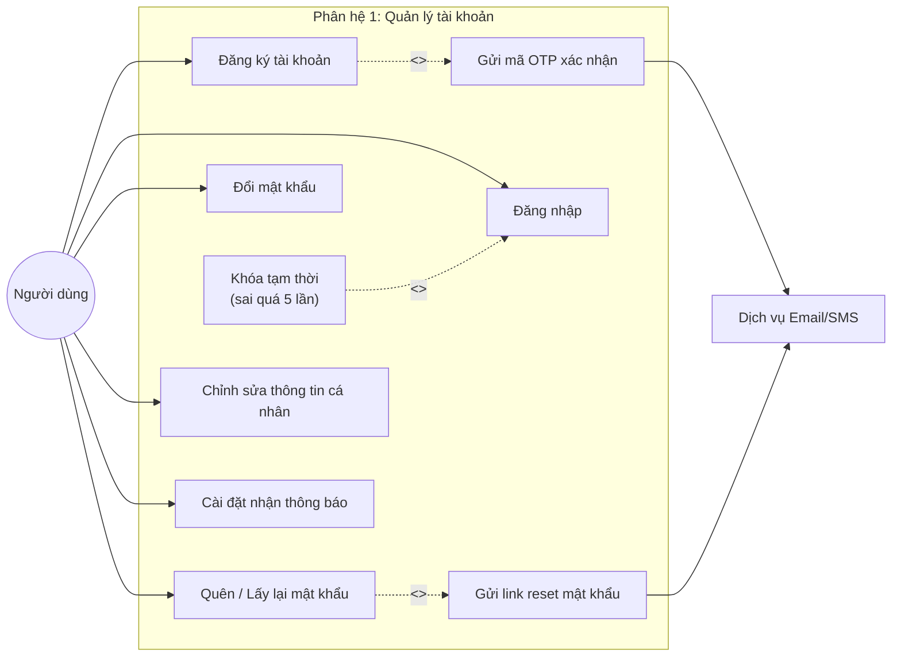
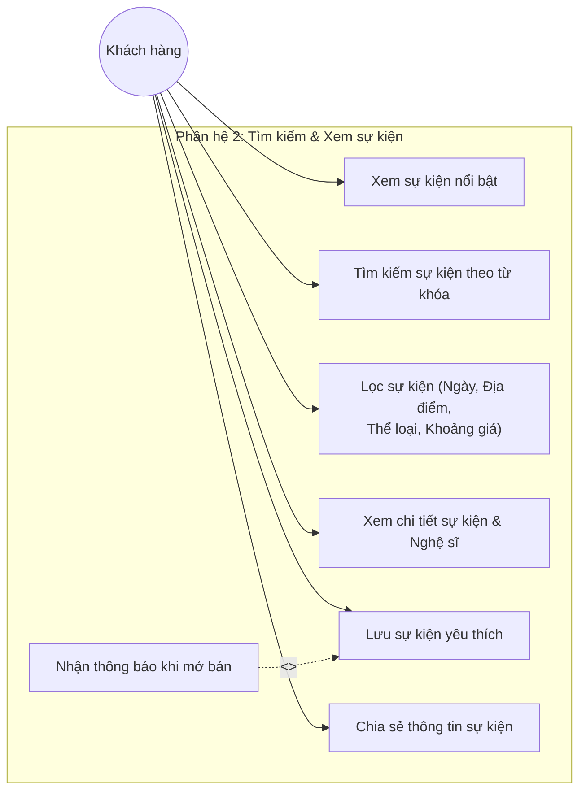
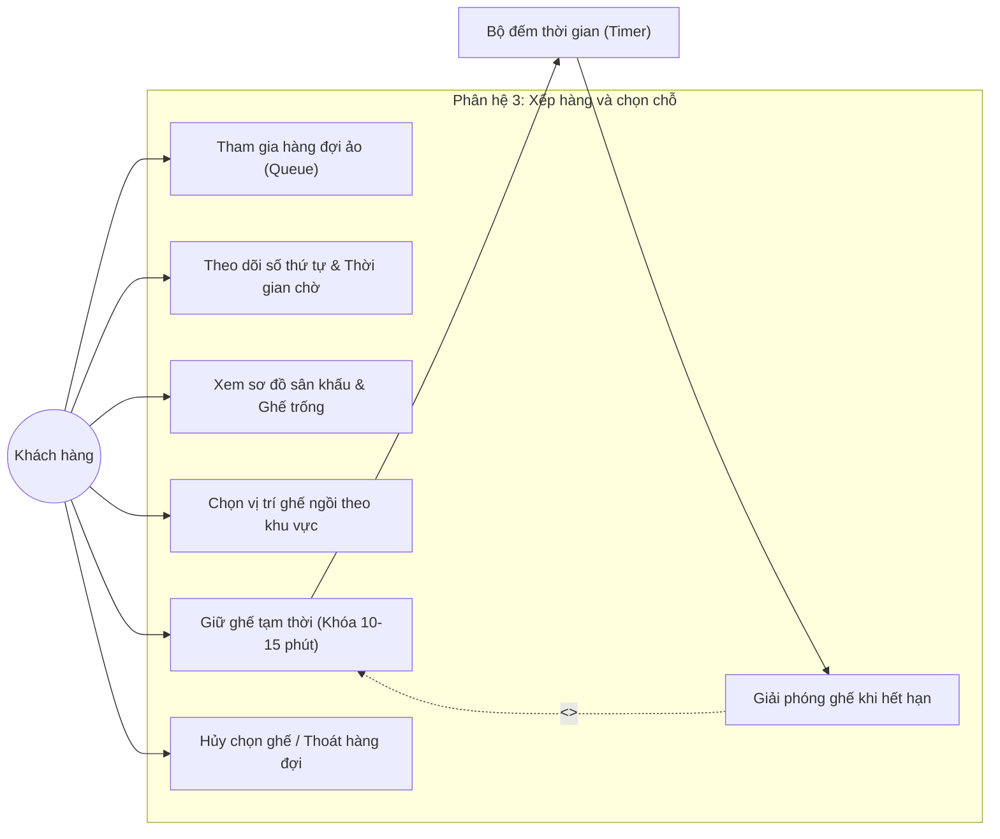
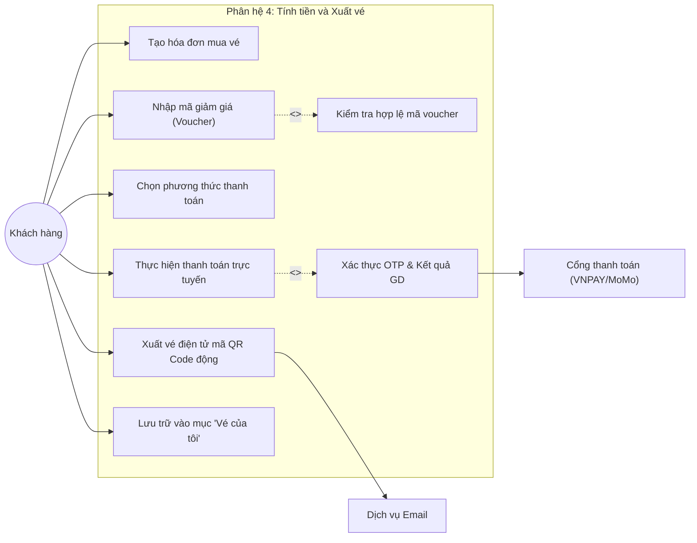
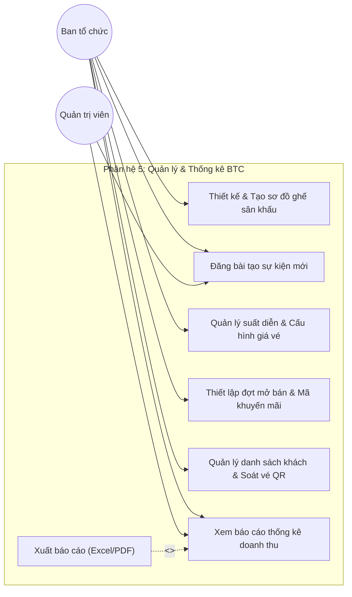
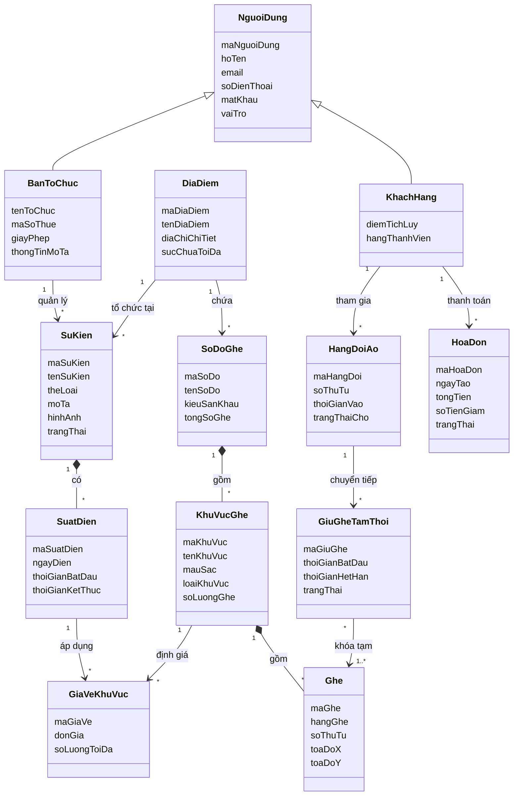
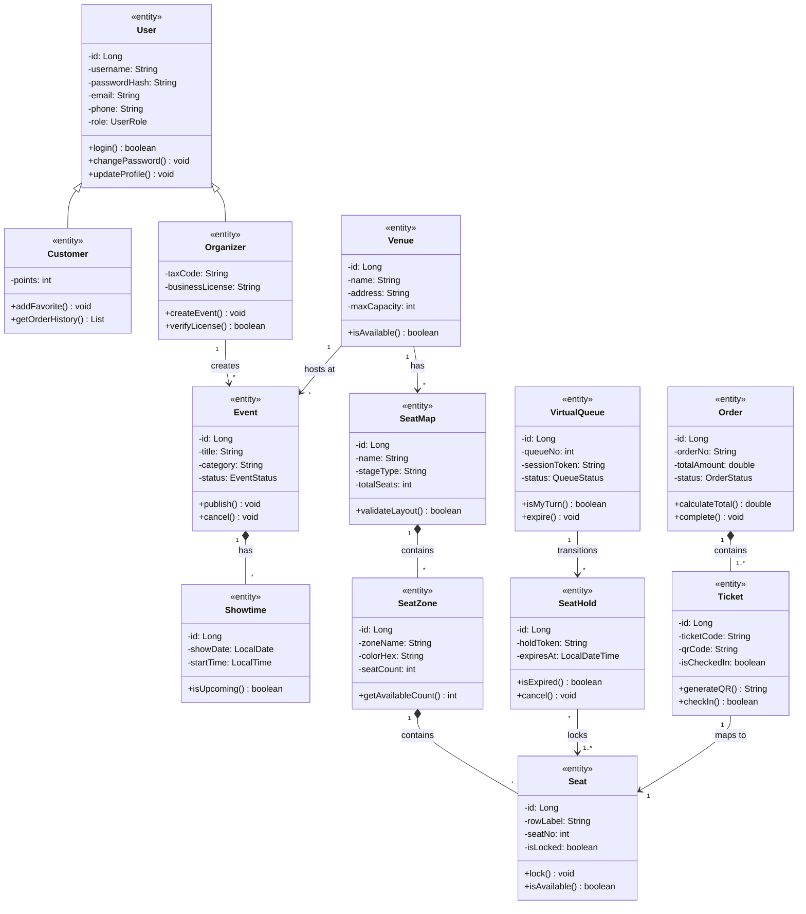

# BÁO CÁO PHÂN TÍCH VÀ THIẾT KẾ HỆ THỐNG THÔNG TIN
## ĐỀ TÀI: HỆ THỐNG ĐẶT VÉ THAM GIA SỰ KIỆN TRỰC TUYẾN
**Học viện Công nghệ Bưu chính Viễn thông (PTIT)**  
**Lớp học phần:** N12 | **Giảng viên hướng dẫn:** TS. Nguyễn Đức Hiển (Email: `ndhien@hotmail.com`)  
**Tệp nộp bài Word:** `N12 Nhóm 01.docx` (kèm tệp hoàn chỉnh: `N12 Nhóm 01 - HoanChinh.docx`)

---

## 1. MÃ SỐ NHÓM, TÊN ĐỀ TÀI, HỌ TÊN CÁC THÀNH VIÊN – CHỨC NĂNG

* **Tên đề tài:** Xây dựng Hệ thống đặt vé tham gia sự kiện trực tuyến (*Online Event Ticket Booking System*).
* **Mã số nhóm:** Nhóm 01 (Lớp tín chỉ: N12) *(Sinh viên có thể tùy biến sang mã số nhóm thực tế)*.
* **Mục tiêu hệ thống:** Hệ thống cung cấp giải pháp bán vé sự kiện đa quy mô (Liveshow, Concert, Kịch, Thể thao, Hội thảo), giải quyết triệt để bài toán thắt nút cổ chai (Bottleneck) khi mở bán vé giờ cao điểm thông qua cơ chế **Phòng chờ ảo (Virtual Waiting Queue)**, hiển thị **Sơ đồ khán đài theo thời gian thực (Real-time Seat Map)**, cơ chế **Giữ ghế tạm thời (Countdown Timer)**, thanh toán trực tuyến an toàn và phát hành **Vé điện tử kèm mã QR Code động**.

### Bảng phân công thành viên và chức năng phụ trách

| STT | Họ và tên | Mã sinh viên | Vai trò | Phân hệ (Module) & Chức năng phụ trách chính |
|:---:|:---|:---:|:---:|:---|
| **1** | **Nguyễn Văn A** | B21DCCN001 | Nhóm trưởng | **Module 1: Quản lý tài khoản người dùng** • Đăng ký, đăng nhập tài khoản (phân quyền Role-based) • Đổi mật khẩu, lấy lại mật khẩu qua mã xác thực Email OTP • Chỉnh sửa thông tin hồ sơ cá nhân • Cấu hình tùy chọn nhận thông báo và email |
| **2** | **Trần Thị B** | B21DCCN002 | Thành viên | **Module 2: Tìm kiếm & Xem sự kiện** • Xem danh sách sự kiện nổi bật, thịnh hành (Trending/Hot) • Tìm kiếm và lọc đa tiêu chí (ngày diễn, địa điểm, thể loại, khoảng giá) • Xem trang chi tiết sự kiện, dàn nghệ sĩ/khách mời biểu diễn • Lưu danh sách sự kiện yêu thích (Wishlist) & chia sẻ sự kiện |
| **3** | **Lê Văn C** | B21DCCN003 | Thành viên | **Module 3: Xếp hàng và chọn chỗ** • Xếp hàng đợi ảo (Virtual Queue) khi lưu lượng truy cập lớn • Hiển thị sơ đồ khán đài và trạng thái từng ghế thời gian thực • Chọn vị trí ghế ngồi (VIP, Standard, Fan Zone, vé đứng) • Khóa giữ ghế tạm thời (10–15 phút có bộ đếm ngược) |
| **4** | **Phạm Thị D** | B21DCCN004 | Thành viên | **Module 4: Tính tiền và Xuất vé** • Tạo đơn hàng mua vé, áp dụng mã voucher giảm giá • Thanh toán trực tuyến qua cổng VNPAY, Ví MoMo, Thẻ ATM/Visa • Xử lý giao dịch và sinh mã vé điện tử QR Code động chống giả mạo • Gửi vé qua Email và lưu trữ vào danh mục "Vé của tôi" |
| **5** | **Hoàng Văn E** | B21DCCN005 | Thành viên | **Module 5: Quản lý và thống kê dành cho ban tổ chức** • Công cụ vẽ & tạo sơ đồ các khu vực ghế ngồi cho sân khấu • Đăng bài tạo sự kiện mới, quản lý lịch diễn và cấu hình giá vé • Quản lý đợt mở bán vé (Early Bird, Regular) và mã khuyến mãi • Quản lý danh sách check-in và xem báo cáo tổng kết doanh thu |

---

## 2. BIỂU ĐỒ USE CASE CHO HỆ THỐNG VÀ CHO CÁC CHỨC NĂNG

### 2.1. Biểu đồ Use Case tổng thể toàn hệ thống

Biểu đồ bao quát toàn bộ 5 phân hệ chức năng tương tác với các tác nhân trong và ngoài hệ thống:
* **Tác nhân chính (Actors):**
  * `Khách hàng (Customer)`: Tìm kiếm sự kiện, xếp hàng, chọn ghế, thanh toán và nhận vé điện tử.
  * `Ban tổ chức (Organizer)`: Thiết kế sơ đồ ghế, đăng sự kiện, cấu hình giá vé, quản lý check-in và xem báo cáo doanh thu.
  * `Quản trị viên (Administrator)`: Quản lý người dùng, duyệt sự kiện và giám sát vận hành hệ thống.
* **Tác nhân hệ thống ngoài (External Systems):**
  * `Cổng thanh toán (Payment Gateway)`: VNPAY / MoMo xử lý giao dịch tài chính trực tuyến.
  * `Dịch vụ Email/SMS (Notification Service)`: Gửi OTP xác thực, thông báo mở bán và tệp vé điện tử QR.

---

### 2.2. Biểu đồ Use Case Phân hệ 1: Quản lý tài khoản người dùng

**Đặc tả tóm tắt Use Case Phân hệ 1:**
* **Đăng ký tài khoản:** Khách hàng điền thông tin -> Hệ thống validate dữ liệu -> Gửi mã OTP xác thực email -> Hoàn tất kích hoạt tài khoản.
* **Đăng nhập:** Người dùng nhập username/email và mật khẩu -> Hệ thống băm kiểm tra (BCrypt) -> Cấp JWT Token. Nếu nhập sai 5 lần liên tiếp, kích hoạt Use Case mở rộng khóa tài khoản trong 15 phút.
* **Quên mật khẩu:** Người dùng nhập email -> Nhận mã bảo mật qua email -> Nhập mật khẩu mới.

---

### 2.3. Biểu đồ Use Case Phân hệ 2: Tìm kiếm & Xem sự kiện

**Đặc tả tóm tắt Use Case Phân hệ 2:**
* **Tìm kiếm & Lọc sự kiện:** Người dùng tìm kiếm toàn văn theo tên nghệ sĩ, sự kiện; áp dụng bộ lọc đa chiều (theo thành phố, thời gian diễn ra cuối tuần này, thể loại nhạc kịch/Concert, giá vé từ thấp đến cao).
* **Xem chi tiết sự kiện:** Hiển thị poster, mô tả kịch bản, lịch diễn các suất (Showtimes), dàn nghệ sĩ khách mời, sơ đồ khán đài và chính sách vé.
* **Lưu sự kiện yêu thích:** Khách hàng đánh dấu lưu sự kiện; hệ thống tự động gửi thông báo đẩy (Push/Email) nhắc nhở trước thời điểm mở bán vé chính thức 30 phút.

---

### 2.4. Biểu đồ Use Case Phân hệ 3: Xếp hàng và chọn chỗ

**Đặc tả tóm tắt Use Case Phân hệ 3:**
* **Tham gia hàng đợi ảo (Virtual Waiting Room):** Khi sự kiện có số lượng truy cập đồng thời lớn hơn ngưỡng chịu tải, người dùng được xếp vào hàng đợi FIFO. Màn hình hiển thị số thứ tự và thời gian ước tính. Khi tới lượt, hệ thống cấp `QueueToken` cho phép chuyển vào giao diện chọn ghế.
* **Xem sơ đồ & Giữ ghế tạm thời:** Tải sơ đồ ghế dạng SVG thời gian thực qua WebSocket. Ghế được phân loại theo màu sắc: Trắng (trống), Đỏ (đã bán), Vàng (đang chọn). Khi bấm chọn, ghế chuyển sang trạng thái "Tạm khóa" với đồng hồ đếm ngược 10 phút. Nếu hết 10 phút chưa thanh toán, hệ thống tự động giải phóng ghế trả lại trạng thái trống.

---

### 2.5. Biểu đồ Use Case Phân hệ 4: Tính tiền và Xuất vé

**Đặc tả tóm tắt Use Case Phân hệ 4:**
* **Tạo đơn hàng & Nhập voucher:** Hệ thống tổng hợp các ghế đang giữ, tính tạm tính. Người dùng nhập mã giảm giá -> Hệ thống kiểm tra điều kiện (hạn dùng, đơn tối thiểu, số lượng còn) -> Áp dụng giảm giá và tính tổng tiền thanh toán cuối.
* **Thanh toán trực tuyến:** Người dùng chọn VNPAY-QR, Thẻ ATM/Visa hoặc Ví MoMo -> Chuyển hướng sang cổng thanh toán -> Xác thực OTP ngân hàng -> Webhook trả về kết quả thành công -> Cập nhật trạng thái đơn hàng thành `PAID`.
* **Xuất vé điện tử:** Hệ thống sinh mã vé và chuỗi mã hóa QR Code độc nhất chứa chữ ký điện tử -> Gửi vé định dạng PDF/QR qua Email và lưu trữ vào danh mục "Vé của tôi".

---

### 2.6. Biểu đồ Use Case Phân hệ 5: Quản lý và thống kê dành cho ban tổ chức

**Đặc tả tóm tắt Use Case Phân hệ 5:**
* **Thiết kế sơ đồ ghế:** Công cụ Canvas trực quan cho phép BTC dựng khán đài, chia khu vực VIP, CAT 1, CAT 2, vẽ hàng ghế, số ghế và định cấu hình vé ngồi hoặc vé đứng.
* **Tạo sự kiện & Định giá vé:** Nhập mô tả, poster, nghệ sĩ, địa điểm; tạo các suất diễn và gán bảng giá vé cho từng khu vực ghế.
* **Soát vé & Báo cáo:** Ứng dụng quét mã QR tại cửa vào sự kiện xác thực vé hợp lệ trong 1 giây, ngăn chặn vé giả và vé sử dụng lại. Dashboard hiển thị số vé bán, tỷ lệ lấp đầy sân khấu và tổng doanh thu thu được.

---

## 3. BIỂU ĐỒ LỚP THỰC THỂ PHÂN TÍCH CHO HỆ THỐNG VÀ CHO CÁC CHỨC NĂNG

### Nguyên lý lớp phân tích (Analysis Entity Classes)
1. Thể hiện các **khái niệm nghiệp vụ cốt lõi** trong miền bài toán (Domain Model).
2. Mỗi lớp gồm 2 ngăn: **Tên thực thể** và **Danh sách thuộc tính nghiệp vụ thuần túy**.
3. Không phụ thuộc vào kiểu dữ liệu lập trình cụ thể (`int`, `varchar2`, `boolean`...), không có các hàm kỹ thuật `getter/setter`.
4. Thể hiện rõ các mối quan hệ ngữ nghĩa: Kế thừa (Generalization), Kết hợp (Association), Kết tập mạnh (Composition), Kết tập yếu (Aggregation) cùng bản số (Multiplicity).

### 3.1. Biểu đồ lớp thực thể phân tích tổng thể hệ thống

---

### 3.2. Biểu đồ lớp phân tích theo từng phân hệ

#### Phân hệ 1: Quản lý tài khoản người dùng
* Các thực thể: `NguoiDung`, `KhachHang`, `BanToChuc`, `PhienDangNhap`, `ThongBao`.
* Quan hệ: Kế thừa từ `NguoiDung`; Khách hàng sở hữu nhiều `PhienDangNhap`; Người dùng nhận nhiều `ThongBao`.

#### Phân hệ 2: Tìm kiếm & Xem sự kiện
* Các thực thể: `SuKien`, `TheLoai`, `DiaDiem`, `SuatDien`, `NgheSi`, `SuKienYeuThich`.
* Quan hệ: Sự kiện thuộc một Thể loại, tổ chức tại một Địa điểm, bao hàm nhiều Suất diễn; Nghệ sĩ biểu diễn tại nhiều Suất diễn; Khách hàng lưu sự kiện vào danh sách Yêu thích.

#### Phân hệ 3: Xếp hàng và chọn chỗ
* Các thực thể: `SoDoGhe`, `KhuVucGhe`, `Ghe`, `KhachHang`, `HangDoiAo`, `GiuGheTamThoi`.
* Quan hệ: Cấu trúc phân cấp chứa `SoDoGhe` -> `KhuVucGhe` -> `Ghe`; Khách hàng vào `HangDoiAo`; Khi đến lượt tạo bản ghi `GiuGheTamThoi` liên kết với danh sách các `Ghe` đã chọn.

#### Phân hệ 4: Tính tiền và Xuất vé
* Các thực thể: `HoaDon`, `Ve`, `MaGiamGia`, `GiaoDichThanhToan`, `KhachHang`, `Ghe`.
* Quan hệ: `HoaDon` do `KhachHang` lập, áp dụng 0..1 `MaGiamGia`, thanh toán qua 1 `GiaoDichThanhToan`, và bao hàm 1..* `Ve`. Mỗi `Ve` được gán cố định cho 1 `Ghe`.

#### Phân hệ 5: Quản lý và thống kê dành cho BTC
* Các thực thể: `BanToChuc`, `SuKien`, `SuatDien`, `SoDoGhe`, `KhuVucGhe`, `GiaVeKhuVuc`, `BaoCaoDoanhThu`.
* Quan hệ: Ban tổ chức quản lý Sự kiện; Sự kiện liên kết Sơ đồ ghế và Suất diễn; Suất diễn định giá qua `GiaVeKhuVuc` và kết xuất `BaoCaoDoanhThu`.

---

## 4. BIỂU ĐỒ LỚP THỰC THỂ THIẾT KẾ CHO HỆ THỐNG VÀ CHO CÁC CHỨC NĂNG

### Nguyên lý lớp thiết kế (Design Entity Classes)
1. Thể hiện **mô hình hướng đối tượng chi tiết** sẵn sàng ánh xạ ORM (JPA/Hibernate) và sinh mã nguồn.
2. Stereotype `<<entity>>` cho các thực thể dữ liệu.
3. Cấu trúc chuẩn 3 ngăn: **Tên lớp**, **Thuộc tính với phạm vi (`-` private), tên biến và kiểu dữ liệu cụ thể, khóa chính [PK]**, **Phương thức với phạm vi (`+` public), tham số và kiểu trả về**.
4. Các phương thức nghiệp vụ nội tại được mô hình hóa rõ ràng.

### 4.1. Biểu đồ lớp thực thể thiết kế tổng thể hệ thống

---

### 4.2. Từ điển dữ liệu và Lớp thiết kế chi tiết theo 5 phân hệ

#### Phân hệ 1: Quản lý tài khoản (Classes: User, Customer, Organizer, UserSession, Notification)
| Lớp thiết kế | Thuộc tính chi tiết (Kiểu dữ liệu & Ràng buộc) | Phương thức nghiệp vụ (Operations) |
|:---|:---|:---|
| **User** | `- id: Long [PK, Auto]` `- username: String [Unique]` `- passwordHash: String [BCrypt]` `- email: String [Unique]` `- phone: String` `- role: UserRole [Enum]` | `+ authenticate(pwd: String): boolean` `+ changePassword(newPwd: String): void` `+ updateInfo(dto: UserDto): void` `+ isAccountNonLocked(): boolean` |
| **Customer** | `- rewardPoints: int [Default 0]` `- memberTier: MemberTier [Enum]` | `+ addRewardPoints(pts: int): void` `+ getOrderHistory(): List<Order>` `+ canRedeemPoints(pts: int): boolean` |
| **Organizer** | `- orgName: String [Not Null]` `- taxId: String [Unique]` `- businessLicense: String` | `+ verifyLicense(): boolean` `+ getManagedEvents(): List<Event>` `+ updateOrgProfile(info: OrgDto): void` |
| **UserSession** | `- id: Long [PK]` `- jwtToken: String [Not Null]` `- createdAt: LocalDateTime` `- expiresAt: LocalDateTime` | `+ isExpired(): boolean` `+ refreshToken(): String` `+ revoke(): void` |
| **Notification**| `- id: Long [PK]` `- title: String` `- message: String` `- isRead: boolean [Default false]` | `+ markAsRead(): void` `+ sendEmailNotification(): boolean` |

---

#### Phân hệ 2: Tìm kiếm & Xem sự kiện (Classes: Event, Showtime, Category, Venue, Artist, FavoriteEvent)
| Lớp thiết kế | Thuộc tính chi tiết (Kiểu dữ liệu & Ràng buộc) | Phương thức nghiệp vụ (Operations) |
|:---|:---|:---|
| **Event** | `- id: Long [PK]` `- title: String [Not Null]` `- description: String` `- bannerUrl: String` `- status: EventStatus [Enum]` | `+ publish(): void` `+ cancel(): void` `+ isUpcoming(): boolean` `+ getActiveShowtimes(): List<Showtime>` |
| **Showtime** | `- id: Long [PK]` `- showDate: LocalDate [Not Null]` `- startTime: LocalTime [Not Null]` `- endTime: LocalTime` | `+ isAvailableForBooking(): boolean` `+ getAvailableSeats(): int` `+ isOngoing(): boolean` |
| **Category** | `- id: Long [PK]` `- name: String [Unique]` `- code: String [Unique]` | `+ getEvents(): List<Event>` `+ countEvents(): int` |
| **Venue** | `- id: Long [PK]` `- name: String [Not Null]` `- address: String` `- capacity: int [> 0]` | `+ checkCapacity(): boolean` `+ getAssignedSeatMap(): SeatMap` |
| **Artist** | `- id: Long [PK]` `- stageName: String [Not Null]` `- bio: String` `- avatarUrl: String` | `+ getParticipatingEvents(): List<Event>` |
| **FavoriteEvent** | `- id: Long [PK]` `- customerId: Long [FK]` `- savedDate: LocalDateTime` | `+ notifySaleOpening(): void` `+ remove(): void` |

---

#### Phân hệ 3: Xếp hàng và chọn chỗ (Classes: SeatMap, SeatZone, Seat, VirtualQueue, SeatHold)
| Lớp thiết kế | Thuộc tính chi tiết (Kiểu dữ liệu & Ràng buộc) | Phương thức nghiệp vụ (Operations) |
|:---|:---|:---|
| **SeatMap** | `- id: Long [PK]` `- mapName: String [Not Null]` `- totalSeats: int [> 0]` `- layoutSvg: String [SVG Data]` | `+ validateLayout(): boolean` `+ getZones(): List<SeatZone>` `+ getTotalCapacity(): int` |
| **SeatZone** | `- id: Long [PK]` `- zoneName: String [VIP, CAT 1...]` `- colorHex: String [#HEX]` `- zoneType: ZoneType [SEATED, STANDING]` | `+ getSeats(): List<Seat>` `+ countVacantSeats(): int` `+ isStandingZone(): boolean` |
| **Seat** | `- id: Long [PK]` `- rowLabel: String [A, B, C...]` `- seatNumber: int [1, 2, 3...]` `- isLocked: boolean [Default false]` | `+ lockSeat(token: String): boolean` `+ unlockSeat(): void` `+ isAvailable(): boolean` `+ getSeatCode(): String` |
| **VirtualQueue**| `- id: Long [PK]` `- queueNumber: int [Auto]` `- accessToken: String [UUID]` `- status: QueueStatus [WAITING, SERVING, EXPIRED]` | `+ isTurn(): boolean` `+ generateToken(): String` `+ expireToken(): void` |
| **SeatHold** | `- id: Long [PK]` `- holdToken: String [UUID, Unique]` `- startTime: LocalDateTime` `- expiresAt: LocalDateTime` | `+ isExpired(): boolean` `+ getRemainingSeconds(): long` `+ confirmHold(): void` `+ releaseHold(): void` |

---

#### Phân hệ 4: Tính tiền và Xuất vé (Classes: Order, Voucher, PaymentTransaction, Ticket)
| Lớp thiết kế | Thuộc tính chi tiết (Kiểu dữ liệu & Ràng buộc) | Phương thức nghiệp vụ (Operations) |
|:---|:---|:---|
| **Order** | `- id: Long [PK]` `- orderCode: String [ORD-XXXXX]` `- subTotal: double [>= 0]` `- discount: double [>= 0]` `- finalTotal: double [>= 0]` `- status: OrderStatus [PENDING, PAID, CANCELLED]` | `+ calculateFinalTotal(): double` `+ applyVoucher(v: Voucher): boolean` `+ markAsPaid(): void` `+ cancelOrder(): void` |
| **Voucher** | `- id: Long [PK]` `- code: String [Unique]` `- percentOff: double [0.0 - 100.0]` `- maxDiscount: double` `- validUntil: LocalDate` | `+ isValid(amount: double): boolean` `+ calculateDiscount(amount: double): double` `+ decrementQuota(): void` |
| **PaymentTransaction** | `- id: Long [PK]` `- transRef: String [Bank Ref]` `- method: PaymentMethod [VNPAY, MOMO, VISA]` `- transAmount: double` `- status: TransStatus [SUCCESS, FAILED]` | `+ processPayment(): boolean` `+ verifyWebhook(payload: String): boolean` `+ getGatewayUrl(): String` |
| **Ticket** | `- id: Long [PK]` `- ticketCode: String [TCK-XXXXX]` `- qrCodeHash: String [HMAC-SHA256]` `- price: double` `- isUsed: boolean [Default false]` `- checkinTime: LocalDateTime` | `+ generateEncryptedQR(): String` `+ checkIn(): boolean` `+ isCheckedIn(): boolean` `+ cancelTicket(): void` |

---

#### Phân hệ 5: Quản lý và thống kê dành cho ban tổ chức (Classes: Organizer, ZonePricing, RevenueReport)
| Lớp thiết kế | Thuộc tính chi tiết (Kiểu dữ liệu & Ràng buộc) | Phương thức nghiệp vụ (Operations) |
|:---|:---|:---|
| **Organizer** | `- id: Long [PK]` `- companyName: String` `- taxId: String` `- email: String` | `+ createEvent(dto: EventDto): Event` `+ updatePricing(pricingDto): void` `+ viewReports(eventId: Long): RevenueReport` |
| **ZonePricing** | `- id: Long [PK]` `- price: double [>= 0]` `- maxQuota: int` `- soldCount: int` | `+ isSoldOut(): boolean` `+ recordSale(qty: int): void` `+ getRemainingQuota(): int` |
| **RevenueReport**| `- id: Long [PK]` `- totalTicketsSold: int` `- grossRevenue: double` `- occupancyRate: double [0.0 - 100.0%]` `- generatedAt: LocalDateTime` | `+ exportExcel(): byte[]` `+ exportPdf(): byte[]` `+ calculateRevenueByZone(): Map` |

---

## 5. HƯỚNG DẪN NỘP BÀI VÀ THAY ĐỔI THÔNG TIN NHÓM

1. **Tệp tài liệu nộp Thầy Hiển:**
   * Tệp Word đã hoàn chỉnh sẵn sàng để gửi: **`PTTK/N12 Nhóm 01 - HoanChinh.docx`** (hoặc bạn có thể đóng ứng dụng Microsoft Word đang mở và đổi tên thành `N12 Nhóm 01.docx`).
   * Thư mục chứa toàn bộ 18 ảnh sơ đồ chất lượng cao (300 DPI): `PTTK/diagrams/`.
2. **Email nhận bài:** `ndhien@hotmail.com`
3. **Tiêu đề email & tên tệp:** `N12<Nhóm Mã số>.docx` (Ví dụ: `N12 Nhóm 01.docx`).
4. **Cách thay đổi mã nhóm hoặc họ tên thành viên trong 1 câu lệnh:**
   * Mở tệp `generate_word_report.py`, chỉnh sửa thông tin trong mảng `members_data` và `meta_data`.
   * Chạy lệnh `python generate_word_report.py` để sinh lại tệp Word ngay lập tức.
